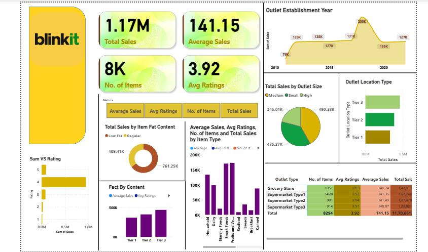

# Blinkt_Sales_Analysis_Dashboard

## Project Overview
This project analyzes Blinkit sales data using Power BI to uncover insights about sales performance, outlet types, item categories, and customer ratings. The dashboard helps understand business trends and supports data-driven decision making.

## Tools & Technologies
- Power BI
- Power Query
- DAX
- Excel / CSV Dataset

## Key Insights
* Total Sales: 1.17M  
* Average Sales: 141.15  
* Average Rating: 3.92  
* Total Items: 8K  

## Dashboard Features
- Sales performance by outlet establishment year
- Sales analysis by outlet size and location type
- Item category performance
- Fat content analysis
- Ratings vs sales comparison

## Key Skills Demonstrated
- Data Cleaning
- Data Transformation using Power Query
- Data Visualization
- KPI Dashboard Creation
- Business Insight Generation

